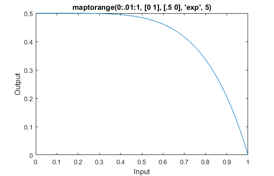

# maptorange
MATLAB script to map values from one range onto another range, either linearly or along a given exponential curve. Also supports inverse ranges, and can extrapolate.

For example, we may map the values 0:.01:1 to their corresponding values between 0 and .5, where 0 becomes .5 and 1 becomes 0, with an exponential curve falloff using the power of 5.

```
plot(0:.01:1, maptorange(0:.01:1, [0 1], [.5 0], 'exp', 5));
```


